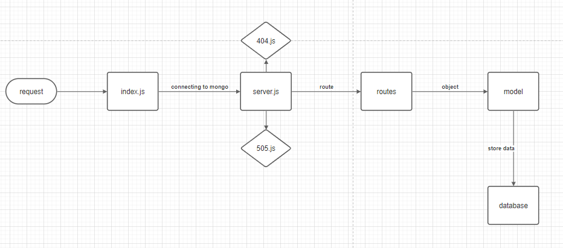

# api-server

[demployment](https://emran-basic-api-server.herokuapp.com/)

[Pull Request](https://github.com/emranaloul/basic-api-server/pull/1)

[Actions](https://github.com/emranaloul/basic-api-server/actions)

[Repo](https://github.com/emranaloul/basic-api-server)


## About 
A REST Express API, has various endpoints that perform CRUD operations on a Mongo Database, using the REST standards . 
It has 2 data models and 2 routers : clothes and food . 
<hr>

## Author
Emran Aloul
<hr>

## Links

* [Pull Request](https://github.com/emranaloul/basic-api-server/pull/1)
* [demployment](https://emran-api-server.herokuapp.com/)
* [Actions](https://github.com/emranaloul/api-server/actions)
* [Repo](https://github.com/emranaloul/api-server)
<hr>

## Setup
1. `(.env)` file 

```
PORT = 4000
MONGOOSE_URI = mongodb://localhost:27017/things
MONGOOSE_TEST_URI = mongodb://localhost:27017/test

```
2. Install the following dependencies

```
npm init -y 
npm i cors dotenv express morgan mongoose
npm i -D jest supertest
npm i @code-fellows/supergoose 
mongod --dbpath=/Users/path/to/data/db

```
## Running the app 
1. clone the repo.
2. Enter the command `npm start`
3. Use endpoints :
   ## Food

  ### *  `/api/v1/food`

<br>

- **Method** : GET 
- **CRUD Operation** : Read / Gets All Food Records
- **Response Body**   : JSON

```
[
    {
        "_id": "60a56705551ded2577c7c720",
        "name": "mansaf",
        "country": "jordan",
        "__v": 0
    }
]

```
<br>

- **Method** : POST 
- **CRUD Operation** : Create / Add a Record
- **Response Body**   : JSON

```
    {
    "_id": "60a59e7a719cee596009cbf0",
    "name": "jeans",
    "country": "jordan",
    "__v": 0
}

```
<br>

 ### * `/api/v1/food/id`
<br>

- **Method** : GET 
- **CRUD Operation** : Read / Get One Record
- **Response Body**   : JSON
```
    {
    "_id": "60a59e7a719cee596009cbf0",
    "name": "jeans",
    "country": "jordan",
    "__v": 0
   }

```
<br>

- **Method** : PUT 
- **CRUD Operation** : UPDATE / Update a Record
- **Response Body**   : JSON
```
    {
    "_id": "60a59e7a719cee596009cbf0",
    "name": "jeans",
    "country": "jordan",
    "__v": 0
}
``` 
<br>

- **Method** : DELETE 
- **CRUD Operation** : DELETE / Delete a Record
- **Response Body**   : JSON

```
    {
    "_id": "60a59e7a719cee596009cbf0",
    "name": "jeans",
    "country": "jordan",
    "__v": 0
}

```
<br><br><br>
<hr>
<br><br>

   ## Clothes
  ### * `/api/v1/clothes`
<br>

- **Method** : GET 
- **CRUD Operation** : Read / Gets All clothes Records
- **Response Body**  : JSON

```
[
    {
        "_id": "60a56ce6c837cb27d79d0d94",
        "name": "shirt",
        "__v": 0
    },
    {
        "_id": "60a56cfac837cb27d79d0d95",
        "name": "jeans",
        "__v": 0
    }
]

```
<br>

- **Method** : POST 
- **CRUD Operation** : Create / Add a Record
- **Response Body**   : JSON
```
{
        "_id": "60a56cfac837cb27d79d0d95",
        "name": "jeans",
        "__v": 0
    }

```
<br>

 ### * `/api/v1/clothes/id`

<br>

- **Method** : GET 
- **CRUD Operation** : Read / Get One Record
- **Response Body** : JSON
```
 {
        "_id": "60a56cfac837cb27d79d0d95",
        "name": "jeans",
        "__v": 0
    }

```
<br>

- **Method** : PUT 
- **CRUD Operation** : UPDATE / Update a Record
- **Response Body**  : JSON
```
 {
        "_id": "60a56cfac837cb27d79d0d95",
        "name": "jeans",
        "__v": 0
    }

```
<br>

- **Method** : DELETE 
- **CRUD Operation** : DELETE / Delete a Record
- **Response Body**   : JSON

```
 {
        "_id": "60a56cfac837cb27d79d0d95",
        "name": "jeans",
        "__v": 0
    }

```
4. Test . 
* There's 2 test files . logger.test.js and server.test.js
* In terminal run :

```
npm test

```
<br><br><br>
<hr>
<br><br>

## UML Diagram
